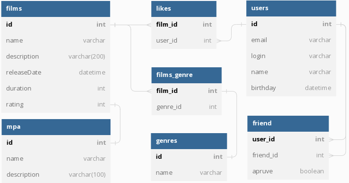

# java-filmorate

---
- PUT /users/{id}/friends/{friendId} — добавление в друзья. 
- DELETE /users/{id}/friends/{friendId} — удаление из друзей. 
- GET /users/{id}/friends — возвращаем список пользователей, являющихся его друзьями. 
- GET /users/{id}/friends/common/{otherId} — список друзей, общих с другим пользователем. 
- PUT /films/{id}/like/{userId} — пользователь ставит лайк фильму. 
- DELETE /films/{id}/like/{userId} — пользователь удаляет лайк. 
- GET /films/popular?count={count} — возвращает список из первых count фильмов по количеству лайков. Если значение параметра count не задано, верните первые 10.
---
Типы ошибок:
- 400 — ошибка валидации; 
- 404 — для всех ситуаций, если искомый объект не найден;
- 500 — возникло исключение.
---
### Схема базы данных
